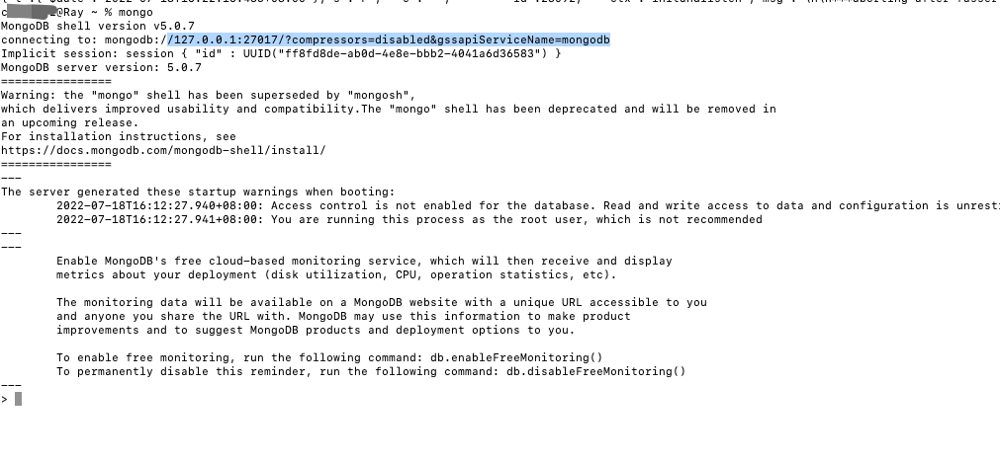

### 关于mongodb

1： 在macOS上的安装 启动

```

brew install mongodb-community@5.0

// 启动服务

brew services start mongodb-community@5.0

// 目前个人电脑。这种方式装在了 目前自己不清楚的地方(等我清楚就来更新文档)

直接根下启动， 目前是启动成功了～

mongo

```

